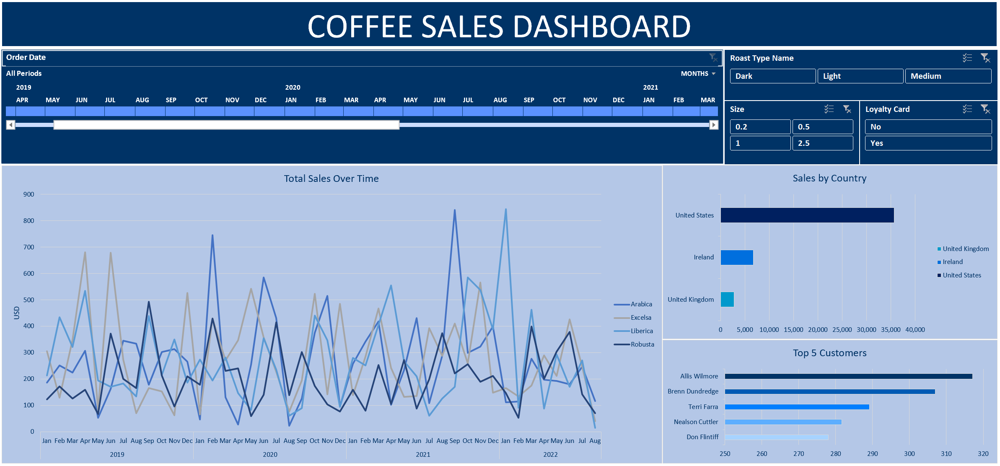

# Coffee Sales Dashboard using Excel

## Project Overview
This project harnesses the power of Excel to transform raw coffee sales data into a visually compelling and interactive dashboard. By diving deep into the data, the dashboard uncovers critical trends, patterns, and correlations that are pivotal for informed decision-making. Tailored for the sales and marketing teams, this tool not only delivers actionable insights but also drives strategic initiatives, ultimately enhancing the operational efficiency and effectiveness of the organization.

## Tools and Skills
- **Excel**: Advanced use of Pivot Tables, Pivot Charts, Slicers, and Timelines for data visualization. Data manipulation and population were performed using VLOOKUP, MATCH, and other Excel functions. Data cleaning techniques were also applied to prepare the dataset for analysis.
- **Data Analysis**: In-depth sales data analysis was conducted to extract valuable insights and answer key business questions.
- **Sales and Marketing Domain Expertise**: Interpreted the data with a strong understanding of sales and marketing operations, ensuring the insights are relevant and actionable.

## Business Question:
**"How do seasonal trends and customer demographics affect the sales of different coffee roast types across various regions, and what strategies can be implemented to optimize inventory and marketing efforts based on these insights?"**

## Insights:
**1. Seasonal Trends and Regional Preferences:**
- **Seasonality:** Distinct seasonal sales trends were identified for different coffee types. Robusta peaks in August-September, Arabica in September, and Excelsa in June, while Liberica shows no consistent seasonal pattern.
- **Regional Preferences:** The United States accounts for the majority of sales across all roast types, highlighting the need to prioritize this region in both inventory and marketing strategies.

**2. Customer Behavior and Loyalty Program:**
- **Customer Behavior:** While most sales are generated by customers without a loyalty membership, the significant contribution from loyalty program members, despite their smaller numbers, underscores the program's effectiveness.
- **Loyalty Program:** The success of the loyalty program suggests potential for further expansion through targeted promotions to enhance customer retention and increase sales.

**3. Marketing Effectiveness:**
- **Targeting U.S. Customers**: U.S.-based customers dominate sales for both loyalty members and non-members, indicating that marketing campaigns should continue to focus heavily on this region.

## Strategic Recommendations
**1. Inventory Management Strategies:**
- **Seasonal Stocking:** Adjust inventory levels ahead of seasonal peaks for each coffee type to ensure product availability during high-demand periods. Specifically, increase stock for Robusta before August-September, Arabica before September, and Excelsa before June.
- **Regional Focus:** Maintain higher inventory levels in the United States, particularly for the most popular roast types.
- **Dynamic Management for Liberica:** Due to the lack of a clear seasonal pattern, monitor Liberica sales closely and adjust inventory dynamically, potentially through targeted marketing campaigns to establish demand patterns.

**2. Marketing Efforts:**
- **Seasonal Campaigns:** Align marketing campaigns with the seasonal peaks of each coffee type to capitalize on natural demand spikes.
- **Expand Loyalty Program:** Enhance the loyalty program by offering exclusive discounts or early access to new products, encouraging more customers to join.
- **U.S.-Focused Marketing:** Develop targeted campaigns that resonate with U.S. consumers, incorporating region-specific preferences and emphasizing the benefits of the loyalty program.

## Key Takeaways:
- **Seasonal Sales Trends:** Understanding the distinct seasonal peaks allows for strategic inventory adjustments, ensuring product availability during peak sales periods.
- **Regional Dominance:** The U.S. market's dominance in sales across all roast types requires focused inventory and marketing strategies in this region.
- **Loyalty Program Potential:** The loyalty program's effectiveness highlights an opportunity for expansion to further boost customer retention and sales.
- **Optimized Marketing:** Aligning marketing efforts with seasonal trends and focusing on the U.S. market are essential strategies for increasing sales.

These insights provide actionable strategies to optimize both inventory management and marketing efforts, ultimately supporting better decision-making and enhancing operational effectiveness within the sales and marketing teams.

